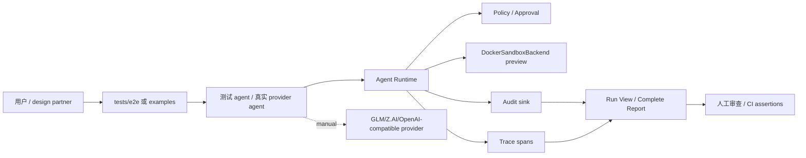
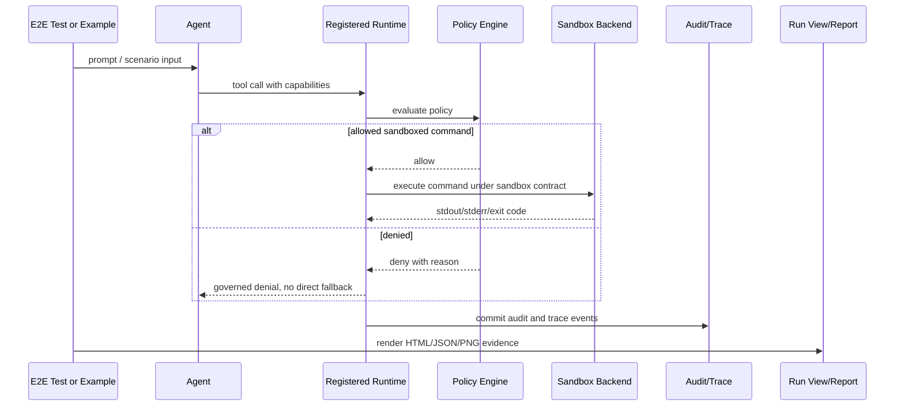
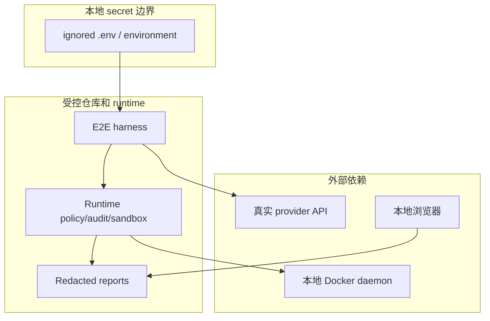

# Agent Runtime E2E 扩展 Architecture Brief

日期：2026-06-21

状态：待实现

上游 spec：[2026-06-21-e2e-expansion-spec.md](../specs/2026-06-21-e2e-expansion-spec.md)

## Context

P0 E2E 扩展要验证真实 provider、registered runtime、policy deny、Docker sandbox failure、run view / complete report browser evidence 和 secret boundary。现有系统已经有 runtime、registry、policy、audit、tracing、provider agent testing helpers、Docker sandbox backend、run view 和 complete report runner。架构目标不是新建一套测试平台，而是把现有模块编排成可复现、可报告、可审计的 E2E harness。

## Module Boundaries

- `tests/e2e/`：P0 自动化 E2E 入口。只放无密钥、可稳定复现、可在 CI 运行或可明确 skip 的测试。
- `examples/`：用户可手工运行的 E2E 入口。真实 provider、browser artifact 和 design partner dry run 优先放这里。
- `src/agent_runtime/testing/`：复用测试 agent、fake provider、production incident agent 和 provider-style helper。
- `src/agent_runtime_contrib/packs/sandbox/docker.py`：真实 Docker sandbox backend，只作为 preview backend 参与 E2E，不变成 stable candidate。
- `src/agent_runtime/run_view.py`：run view HTML 生成和 browser validation 的输入。
- `E2E_TEST_PLAN.md`：E2E backlog、依赖、CI/manual 状态和 requirement mapping。
- `E2E_TEST_REPORT.md`：E2E 执行证据、输出解释和 residual risk。

## Data Flow

1. 测试或 example 选择 agent 场景：fake provider、真实 provider、production incident、sandbox command、browser report。
2. agent 产生 tool call 或 command request。
3. registered runtime 根据 agent metadata、capabilities、runtime profile 和 policy 执行 gating。
4. approval、sandbox、executor、audit、trace 按现有 runtime 链路生成结果。
5. E2E harness 收集 output、audit JSONL、trace events、run view HTML、complete report artifact。
6. 自动化测试断言关键字段；手工门禁生成报告和 secret scan 输出。
7. `E2E_TEST_REPORT.md` 记录用例设计、命令、输出结果、输出解释和结论。

## Diagrams

- Required: yes
- Reason: provider、runtime、sandbox、report、CI/manual gate 之间存在安全和数据流边界。
- System context:

- Sequence:

- Risk boundary:

## Contracts

- E2E case contract:
  - Request: scenario ID、entry command、dependency mode、expected artifacts。
  - Response: pass/skip/manual-blocked/fail、artifact paths、evidence summary、residual risk。
  - Errors: environment unavailable、provider unavailable、policy regression、sandbox unavailable、secret leak detected。
- Runtime evidence contract:
  - Audit JSONL must include policy decision or sandbox enforcement when relevant.
  - Trace must include agent/tool/policy/sandbox spans for registered runtime paths.
  - Deny must include reason and must not execute direct fallback.
- Manual provider contract:
  - Secret source is `.env` or process env only.
  - Report may include provider mode and redacted provider summary, never raw API key.
- Browser evidence contract:
  - HTML artifact must contain agent identity, prompt, tool calls/results, policy/approval/sandbox/audit/trace sections, raw evidence, JSON beauty view where JSON is present.

## Dependencies

- Existing `pytest` suite for automated E2E.
- Existing `DockerSandboxBackend` for real local Docker execution.
- Existing complete report and run view generation helpers.
- Optional local browser tooling for screenshot validation; P0 can start with artifact/content checks plus local screenshot generation.
- `.env` / environment variables for manual real provider E2E.

## Non-Functional Requirements

- Performance: automated P0 E2E stays under two minutes locally when Docker is available.
- Reliability: Docker/provider/browser unavailable must produce skip or manual-blocked evidence, not ambiguous pass.
- Security and privacy: secret scan covers new public docs and generated report text before commit.
- Compatibility: optional providers and browsers do not become core runtime install dependencies.
- Observability: every registered runtime E2E validates audit and trace evidence.

## Operability And Release

- Migration or backfill: none.
- Feature flag or rollout: manual provider/browser E2E remains explicit command, not default CI.
- Logs, metrics, traces, or alerts: E2E checks runtime audit and trace artifacts; no production alerts.
- Rollback: revert E2E tests/docs without changing runtime behavior unless a runtime bug fix is introduced.

## Risks

| Risk | Severity | Likelihood | Mitigation | Owner | Status |
| --- | --- | --- | --- | --- | --- |
| Provider API instability makes manual E2E noisy. | high | medium | Keep provider E2E manual and report blocked reason separately from code failure. | QA | open |
| Docker daemon behavior differs across hosts. | medium | medium | Distinguish unavailable, unsupported, and enforcement failure; avoid claiming absolute isolation. | Developer | open |
| Browser screenshot dependency makes CI brittle. | medium | medium | P0 starts with local screenshot/manual artifact path; CI checks HTML content. | QA | open |
| Secret leaks through provider transcript or report. | high | low | Redact env values, scan artifacts, never commit `.agent-runtime/` output. | Security | open |
| P1 adapter E2E pulls optional dependencies into core install. | medium | medium | Use extras/fakes and keep adapter E2E optional. | Architect | open |

## Alternatives Considered

- Put all E2E in default CI: rejected because real provider, Docker daemon, browser and staging dependencies would make CI flaky.
- Keep only manual runbook: rejected because policy/sandbox/report regressions need automated smoke coverage.
- Create a separate E2E framework service: rejected for P0 because existing examples, runtime helpers and pytest can cover the immediate trust gaps.

## Architecture Decisions

- ADR needed: no separate ADR for P0; this brief is enough.
- Decision: Use layered E2E gates: default automated smoke, optional local Docker, manual real provider, manual browser/staging.
- Consequences: P0 improves trust without making CI depend on external secrets or hosted infrastructure; P1/P2 can add richer integrations later.

## Handoff Package

- `from_role`: Architect
- `to_role`: Security / QA / Developer
- `handoff_reason`: Convert spec into security gates, QA matrix and implementation batches.
- `input_context`: P0 requires real provider manual E2E, direct vs registered evidence, Docker sandbox failure paths and browser/report validation.
- `decisions_already_made`: Keep real provider and browser/staging manual; keep Docker backend preview; require audit/trace for registered paths.
- `open_questions`: Whether browser screenshot should enter CI after local evidence stabilizes.
- `expected_output`: security gate, QA plan, implementation plan and P0 tests.
- `acceptance_criteria`: AC-E2E-X-001 到 AC-E2E-X-010。
- `risk_notes`: Secret boundary, Docker boundary, provider instability and optional dependency creep.
