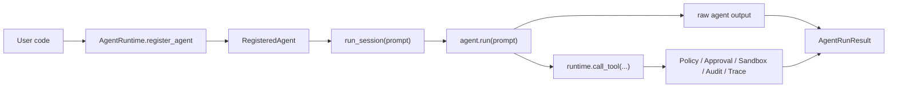

# Runtime Core API 稳定化架构说明

状态：Approved for P0 implementation  
日期：2026-06-21

## 架构决策

新增一层 agent execution session contract，把“agent 自己返回什么”与“runtime 如何解释一次运行”分离。

## 新边界

### Agent 层

agent 可以返回任意 Python 值：

- `dict`
- `str`
- framework transcript
- dataclass
- 自定义对象

agent 不需要继承 runtime base class。

### Session 层

`run_session` 负责把任意 agent 输出包装为 `AgentRunResult`：

- `status`
- `output`
- `tool_results`
- `trace_id`
- `agent_span_id`
- `audit_events`
- `error`

### Governance 层

工具调用仍然只能通过 `runtime.call_tool()` 进入治理链路。`run_session` 不改变 tool execution path。

## 兼容策略

`RegisteredAgent.run(...)` 保持现状，继续面向已有示例和报告中的 transcript contract。

`RegisteredAgent.run_session(...)` 是新推荐入口，面向通用 agent 接入和未来多语言 contract。

## 后续演进预留

- `AgentRunRequest.context` 可承载 tenant、workspace、session tags。
- `AgentRunResult.to_dict()` 可作为 CLI / HTTP / sidecar 返回体。
- 其他语言 SDK 可以只实现 JSON contract，不必复制 Python 对象模型。
